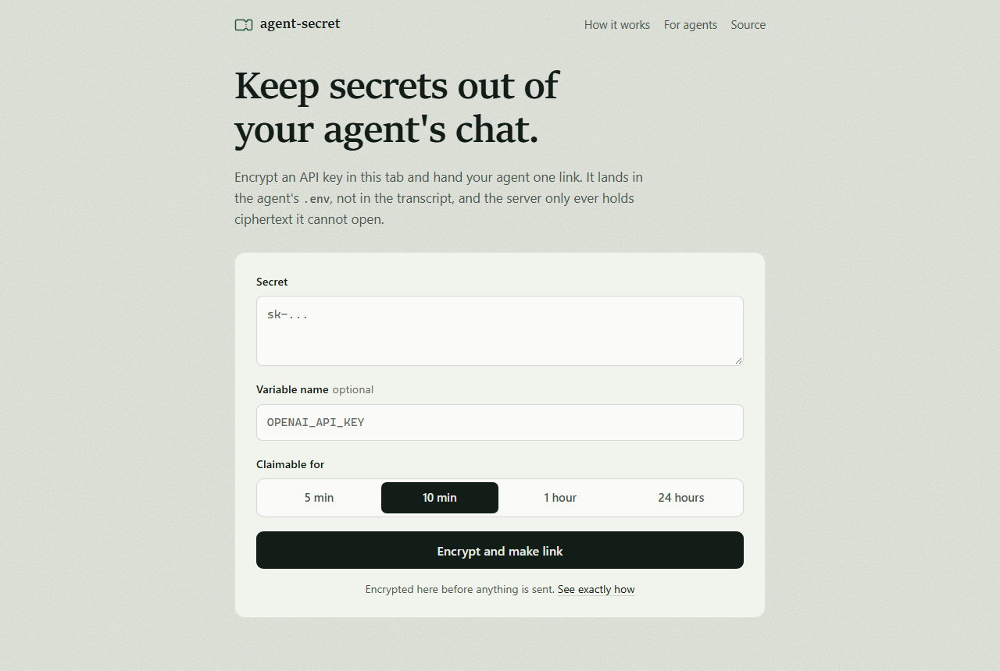

# agent-secret

**Hand your AI agent a secret through a one-time link, so it never sits in the chat transcript.**

[](https://github.com/mrcsXndr/agent-secret/releases/latest)
[](LICENSE)
[](https://agent-secret.xndr.io)

[agent-secret.xndr.io](https://agent-secret.xndr.io) · [How it works](#how-it-works) · [For AI agents](#for-ai-agents) · [Self-host](#self-host) · MIT

[](https://agent-secret.xndr.io)

## Why

When you paste an API key into an agent's chat, it stays in the transcript, the logs and the model context for as long as those are kept. You usually just wanted it in the agent's `.env`.

agent-secret moves that handoff out of the chat. You encrypt the secret in your browser and give your agent one link. The agent claims it once, decrypts it locally and writes it where secrets belong. The server only ever holds ciphertext it cannot open, and after the claim the link left in the transcript is dead.

## 30-second version

1. Open [agent-secret.xndr.io](https://agent-secret.xndr.io), paste the secret, optionally name it (`OPENAI_API_KEY`), pick how long it stays claimable.
2. Click **Encrypt and make link**, then **Copy**. You get one spec line and one link:

   ```
   OPENAI_API_KEY: one-time secret from agent-secret. GET the URL on the last line without its #fragment, using your own User-Agent; it answers once with JSON {ct,iv} (base64), then 410. Decrypt AES-256-GCM: key = base64url-decode(#fragment), nonce = iv, ct ends with the 16-byte tag. Save the plaintext as OPENAI_API_KEY in your env or a gitignored .env; never print it. Full spec: https://agent-secret.xndr.io/llms.txt
   https://agent-secret.xndr.io/k7f2-9m3q#Q2xvc2VkIGJ5IGRlZmF1bHQuIE9wZW4gYnkgY2hvaWNl
   ```

3. Paste that to your agent. It claims the link, saves the value and confirms by name.

## How it works

The link has two halves: `https://agent-secret.xndr.io/k7f2-9m3q` `#Q2xv…`. Browsers, curl and fetch never send the part after `#` to the server, so the server sees the code and never the key.

1. Your browser makes a random 256-bit key and encrypts the secret with AES-256-GCM (WebCrypto). See [`src/worker/form.ts` lines 20-27](src/worker/form.ts#L20-L27).
2. It POSTs only `{ ct, iv, ttl }`: ciphertext with the 16-byte tag appended, the 12-byte nonce and the expiry. No key, no name. See [lines 29-32](src/worker/form.ts#L29-L32).
3. The Worker stores that in Workers KV under a random code (`xxxx-xxxx`, 31^8 space) and returns the code. The page builds the link `/<code>#<key>`.
4. The agent GETs `/<code>`. The Worker returns `{ ct, iv }` and overwrites the record with a tombstone (no ciphertext) in the same request. A second GET gets `410`.
5. The agent decrypts locally with the key from the fragment.

Unclaimed secrets expire after 5 minutes to 24 hours and are purged from KV.

### What the server sees

| | Your tab | Server | Agent | Link previews |
|---|---|---|---|---|
| The secret | yes | no | yes | no |
| The key | yes | no | yes | no |
| Ciphertext | yes | yes | yes | no |
| Variable name | yes | no | yes | no |
| IP and timing | n/a | yes | n/a | n/a |

The server also learns the ciphertext length (secret length + 16 bytes). Link-preview bots (Slack, Telegram, Discord, LinkedIn and others, matched by User-Agent) get a short note instead of the ciphertext, so pasting the link into a chat app does not burn it.

### Threat model: what it does not protect against

- **The link is the secret until it is claimed.** Anyone who sees the whole link first can claim it. Your agent then gets `410`: rotate the secret.
- **Single use is best effort.** Workers KV has no compare-and-set, so two claims racing within KV's propagation window can both succeed. A Durable Object would make it strict; this version does not use one.
- **Previews do not burn, and do not warn.** A recognised preview bot never consumes the link, so it cannot tell you the link was pasted somewhere. An unrecognised bot will burn it, though it still cannot decrypt.
- **You trust the page you load.** A compromised server could serve a script that leaks the key. The page's Content-Security-Policy pins its one inline script by SHA-256 hash and shows that hash on the page; compare it with the source, or self-host.
- **Your agent sees the plaintext.** That is the point. This keeps the secret out of the transcript, not out of the agent's machine. An agent that prints the value puts it back in the transcript.
- **Rate limiting is soft.** Per-IP, per-minute and per-location (KV is eventually consistent). The code space and short TTLs are the real guard against guessing.

### Verify it yourself

- View the page source: one inline script, no external files, no analytics.
- Open the network tab and create a test secret: the only request carries `ct`, `iv` and `ttl`.
- Read the response headers: `script-src 'sha256-…'` allows exactly one script, `connect-src 'self'` stops the page talking to any other origin. `npm test` checks that the hash matches the source.
- Read [`src/worker/app.ts`](src/worker/app.ts), about 200 lines. The Worker has no keys of its own.

## For AI agents

Given a link `https://<host>/<code>#<key>`. The same text is served as plain text at [`/llms.txt`](https://agent-secret.xndr.io/llms.txt).

1. Split the link at `#`. URL = the part before, key = the part after. Never send the key anywhere.
2. GET the URL once, with a User-Agent of your own (e.g. `agent-secret-client/1.0`). That read burns the secret.
3. Decrypt AES-256-GCM: key = base64url-decode(fragment), 32 bytes. Nonce = base64-decode(`iv`), 12 bytes. Input = base64-decode(`ct`), ciphertext with the 16-byte tag appended. The UTF-8 plaintext is the value; nothing is wrapped around it.
4. Write it straight to an environment variable, a gitignored `.env` or a secret manager.
5. Never print, log or repeat the value. Confirm by name only.

| Status | Body | Meaning |
|---|---|---|
| `200` | `{"ct","iv"}` (base64) | Claimed. The secret is now burned. |
| `410` | `already_claimed` / `expired` | Someone claimed it first, or it expired. Ask for a new link and rotate the secret. |
| `404` | `not_found` | Wrong code, or expired and purged. |
| `403` | `error code: 1010` (plain text) | Cloudflare's Browser Integrity Check refused a library default User-Agent (Python-urllib is one) before the request reached the Worker. Nothing was claimed. Retry with your own User-Agent. |
| `429` | `rate_limited` | Wait a minute. |

Libraries differ on the tag: WebCrypto and Python `cryptography` take `ct` whole; Node's `createDecipheriv` wants the last 16 bytes passed via `setAuthTag`, as below.

**curl + node (bash):**

```sh
LINK='PASTE-THE-LINK-HERE'   # https://<host>/<code>#<key>
NAME=OPENAI_API_KEY          # the variable the value should land in
curl -sS -A 'agent-secret-client/1.0' "${LINK%%#*}" |
KEY="${LINK#*#}" NAME="$NAME" node -e '
const r = JSON.parse(require("fs").readFileSync(0, "utf8"));
if (!r.ct) throw new Error("claim failed: " + (r.error || "no ciphertext"));
const c = Buffer.from(r.ct, "base64");
const d = require("crypto").createDecipheriv("aes-256-gcm",
  Buffer.from(process.env.KEY, "base64url"), Buffer.from(r.iv, "base64"));
d.setAuthTag(c.subarray(-16));
const v = Buffer.concat([d.update(c.subarray(0, -16)), d.final()]).toString("utf8");
require("fs").appendFileSync(".env", process.env.NAME + "=" + v + "\n");
console.log("saved " + process.env.NAME + " to .env");'
```

**Python:**

```python
# pip install cryptography
import base64, json, urllib.request
from cryptography.hazmat.primitives.ciphers.aead import AESGCM

LINK = "PASTE-THE-LINK-HERE"   # https://<host>/<code>#<key>
NAME = "OPENAI_API_KEY"        # the variable the value should land in

url, key = LINK.split("#", 1)
req = urllib.request.Request(url, headers={"User-Agent": "agent-secret-client/1.0"})
with urllib.request.urlopen(req) as res:   # raises HTTPError on 403/404/410/429
    body = json.load(res)
value = AESGCM(base64.urlsafe_b64decode(key + "=" * (-len(key) % 4))).decrypt(
    base64.b64decode(body["iv"]), base64.b64decode(body["ct"]), None
).decode("utf-8")
with open(".env", "a", encoding="utf-8") as f:
    f.write(f"{NAME}={value}\n")
print(f"saved {NAME} to .env")
```

Both append to `.env` in the current directory and print only the name.

## API

| Method | Path | Purpose |
|---|---|---|
| `GET` | `/` | The page. All crypto runs here. |
| `POST` | `/` | Create. Body `{ ct, iv, ttl? }` (base64). Returns `{ code, expiresAt, ttl }`. |
| `GET` | `/:code` | Claim and burn. Returns `{ ct, iv }` once, then `410`. Preview bots get a note. |
| `GET` | `/:code/meta` | Lifecycle only: `{ exists, claimed?, expiresAt? }`. Never ciphertext. |
| `DELETE` | `/:code` | Destroy now. |
| `GET` | `/llms.txt` | The agent protocol as plain text. |
| `GET` | `/robots.txt`, `/sitemap.xml`, `/.well-known/security.txt` | Crawl rules (claim links disallowed), the public pages, the security contact. |

Every secret route answers `Cache-Control: no-store`. Static files (`/og.png`, `/favicon.svg`, `/apple-touch-icon.png`) come from `public/` with cache rules in `public/_headers`.

## Self-host

One Cloudflare Worker and one KV namespace. There are no server secrets to configure.

```console
git clone https://github.com/mrcsXndr/agent-secret && cd agent-secret
npm install
npx wrangler kv namespace create SECRETS   # put the printed id in wrangler.toml
# in wrangler.toml: set your own account_id, and point [[routes]] at your domain (or remove it)
npx wrangler deploy
```

Local: `npm run dev` (http://localhost:8787), `npm test`, `npm run typecheck`. `RATE_LIMIT_PER_MIN` in `wrangler.toml` (default `30`) is the only setting. `public/og.png` is the social preview image, rendered from [`docs/launch/og.html`](docs/launch/og.html).

Stack: Cloudflare Workers, Hono (the only runtime dependency), Workers KV, WebCrypto, TypeScript, Vitest.

## Security

Please report vulnerabilities privately through [GitHub security advisories](https://github.com/mrcsXndr/agent-secret/security/advisories/new), not in public issues. See [SECURITY.md](SECURITY.md).

## Changelog

See [CHANGELOG.md](CHANGELOG.md).

## License

[MIT](LICENSE) © XNDR SLU
